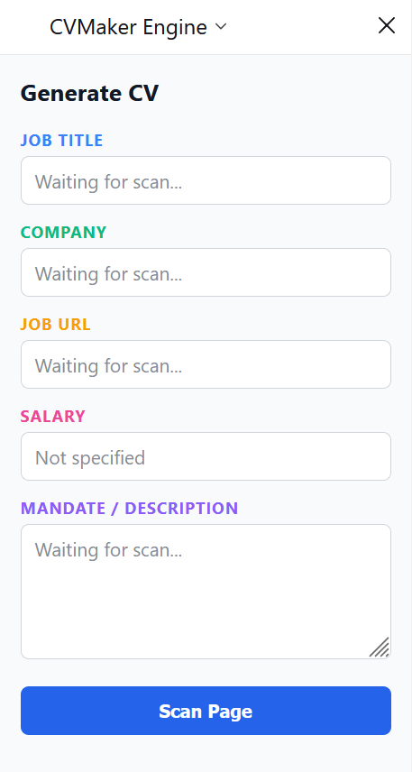

# Browser Extension Integration

## Overview
This browser extension allows users to extract job offer details directly from job portals (e.g., LinkedIn, Indeed) and send them seamlessly into the desktop application's CV Maker workspace.

<p align="center">
  
</p>

---

## Architecture & Data Flow
```
[Web Page DOM] ◄──(Content Script)──► [Extension Sidebar / Popup UI]
                                │
                         (Fetch / POST)
                                │
                                ▼
                  [Local HTTP Server (Port 9123)]
                                │
                    (Main Electron Process)
                                │
                              (IPC)
                                ▼
                    [Renderer / Zustand Store]
```

1. **Trigger & Extraction**: The user opens the extension sidebar (`Ctrl+Shift+Y` or `Cmd+Shift+Y`) or triggers the action. The Sidebar communicates with the **Content Script** injected into the active web page to extract structured job metadata (`JobOfferPayload`).
2. **Bridge**: The extension sends a `POST` request to `http://127.0.0.1:9123/api/job`.
3. **Dispatch**: The local HTTP server running inside the Electron Main process receives the payload and forwards it to the active `BrowserWindow` via IPC (`JOB_RECEIVED_FROM_EXTENSION`).
4. **State Management**: The Electron frontend listener updates `incomingJob` in `useUiStore` and automatically navigates to the CV Maker workspace.

---

## Technical Choices & Rationale
## Technical Choices & Rationale
- **Multi-Bundle Architecture (Vite 8 / Rolldown)**: Extension components run in distinct execution contexts with strict isolation rules:
  - **Sidebar / UI**: Standard ESM bundle with HTML entry point.
  - **Content Script & Background / Service Worker**: Compiled as isolated **IIFE** (Immediately Invoked Function Expression) targets to prevent `import` statement runtime errors in browser sandboxes.
- **Why a local HTTP server?** Browsers restrict direct IPC communication with external native desktop applications. A lightweight HTTP server listening on `127.0.0.1` acts as a secure, local bridge.
- **CORS Handling**: `HttpServerService` handles `OPTIONS` preflight requests and enforces standard local origin checks.

---

## Local Development & Build Commands

Navigate to the `navigator_extension` directory before running scripts:

```bash
cd navigator_extension
```

### Build & Watch Commands
The build pipeline leverages Vite multi-mode configurations to generate dedicated outputs for each browser target inside dist/:

| Command               | Target  | Description                                                  |
|-----------------------|---------|--------------------------------------------------------------|
| npm run dev           | Firefox | Runs Firefox multi-target build and watches for file changes |
| npm run build:firefox | Firefox | Builds production outputs to dist/firefox/                   |
| npm run build:chrome  | Chrome  | Builds production outputs to dist/chrome/                    |

### Testing in Browsers
#### 1. Load Extension in Firefox
- Open Firefox and navigate to about:debugging#/runtime/this-firefox.
- Click Load Temporary Add-on....
- Select navigator_extension/dist/firefox/manifest.json.
- Go to `about:addons`, click on CVMAKER extractor, in `Permissions and data`, check 'Access local files on your computer'

#### 2. Load Extension in Chrome / Edge / Brave
- Open Chrome and navigate to `chrome://extensions/`.
- Enable Developer mode (toggle at top right).
- Click Load unpacked.
- Select the directory `navigator_extension/dist/chrome/`.

#### 3. Test the End-to-End Flow
- Ensure the CV Maker Electron desktop application is running (`npm run dev`).
- Navigate to a job offer page (e.g., LinkedIn, Indeed, Welcome to the Jungle).
- Open the extension sidebar with Ctrl+Shift+Y (or Cmd+Shift+Y on macOS).
- Click Scan Page / Extract Job.
- Verify in Electron DevTools console (Ctrl+Shift+I) that Received job from extension: is logged and the desktop UI switches to the CV Maker view.

#### Payload Schema (`JobOfferPayload`)
```TypeScript
interface JobOfferPayload {
  title: string;
  company: string;
  salary?: string;
  url: string;
  mandate: string;
  extractedAt: string;
}
```

---
## Scraper Architecture & Adapters

To reliably extract job offer details across various websites, the extension uses a modular adapter-based architecture located in `./src/scrapers/`.

### Directory Overview
- `./src/scrapers/adapters/`
  - **Purpose**: Houses site-specific scrapers tailored to popular job boards (e.g., LinkedIn, Indeed, Welcome to the Jungle).
  - **Modularity**: Each adapter implements a unified extraction interface, isolating site-specific DOM breaking changes to single isolated files.

### Generic Scraper (`GenericAdapter.ts`)
- **Fallback Mechanism**: Acts as the primary fallback when no platform-specific adapter matches the active tab URL, or if a platform adapter fails to parse the page.

- **Extraction Strategy**:
 - Structured Data Parsing: Scans for <script type="application/ld+json"> containing JobPosting schemas (Schema.org).
 - Open Graph & Meta Tags: Extracts og:title, og:description, twitter:title, etc.
 - DOM Heuristics: Falls back to standard HTML selectors (document.title, main heading tags) or active page selection.

> Want to know more about this generic adapter? Check [GenericAdapter.md](../docs/GenericAdapter.md)

---

## Adding a New Site Adapter

To add support for a specific job board (e.g., `indeed.com`, `linkedin.com`), create a custom adapter by extending `BaseAdapter` and registering it in the adapter factory.

---

### Step 1: Create the Adapter File

1. Navigate to the scraper directory (`./src/scrapper/adapters`).
2. Create a new TypeScript file named after the target platform (e.g., `IndeedAdapter.ts` or `LinkedInAdapter.ts`).
3. Define a new class that extends `BaseAdapter`.
4. Implement the static `extract()` method inside your class.

---

### Step 2: Implement the Extraction Logic

Inside `extract()`, write the logic to locate and retrieve metadata from the active DOM:

* **Target DOM Elements**: Select site-specific HTML selectors for the job title, company name, location, and full job description text.
* **Leverage `BaseAdapter` Helpers**:
  * **`this.textOf(element)`**: Extracts and sanitizes inner text.
  * **`this.safe(() => fn(), fallback)`**: Wraps DOM queries in error handling so an unmapped element doesn't break the entire scraper.
  * **`this.extractSalary(document | text)`**: Sniffs out salary figures using pattern matching.
  * **`this.isVisible(element)`**: Validates whether target elements are actually rendered on screen.
* **Return the Payload**: Formulate and return an `ExtractionResult` object containing the extracted strings and optional DOM node references (used by the UI for element highlighting).
* **Handle SPAs Automatically**: You don't need to write custom polling loops. The base class provides `extractWhenReady()`, which automatically polls `extract()` until client-rendered single-page app (SPA) content appears.

---

### Step 3: Register the Adapter

1. Open `./src/scrapper/index.ts`.
2. Import your newly created adapter class.
3. Add the target domain mapping to the `DOMAIN_ADAPTER_MAP` object (e.g., `'indeed.com': IndeedAdapter`).
4. Re-export your new adapter from `index.ts`.

---

### Step 4: Verify the Adapter

1. Build or restart the extension development build.
2. Navigate to a job listing on the target platform.
3. Open the extension sidebar and trigger a page scan to confirm that all fields, salary info, and node highlights map correctly.